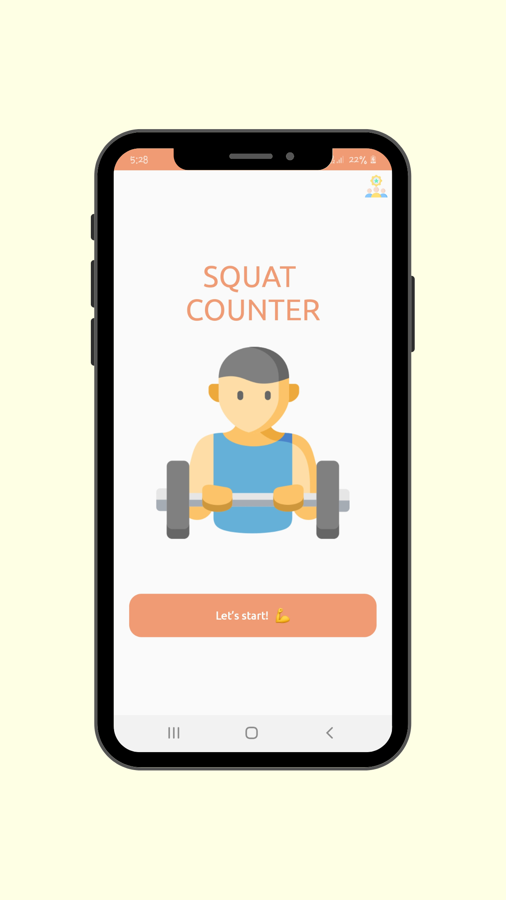
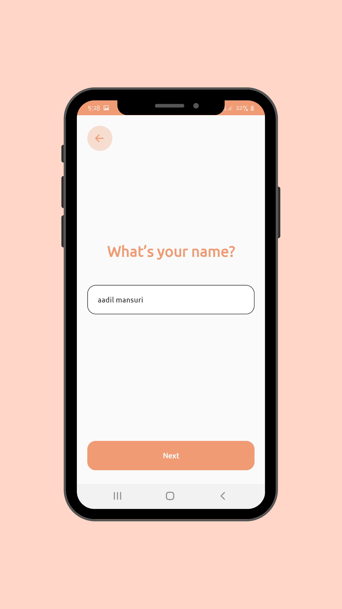
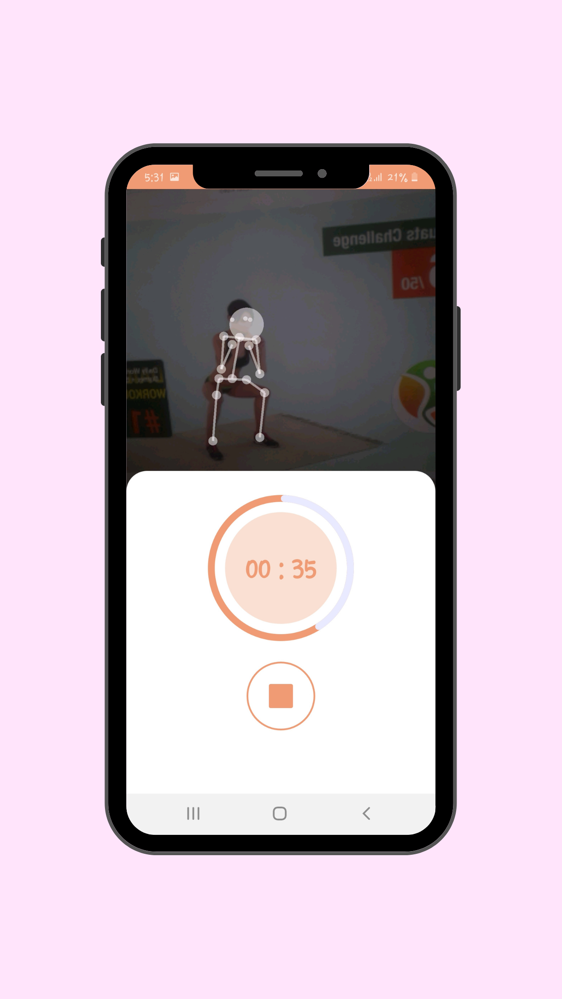
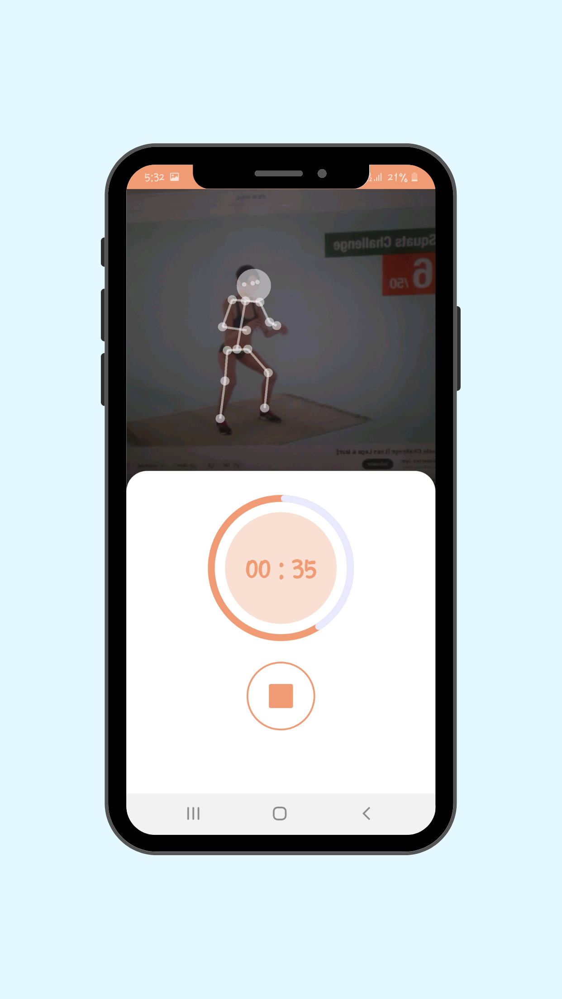
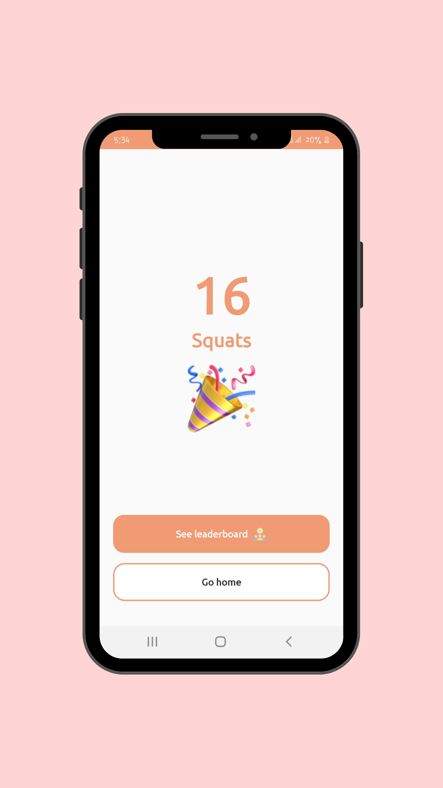
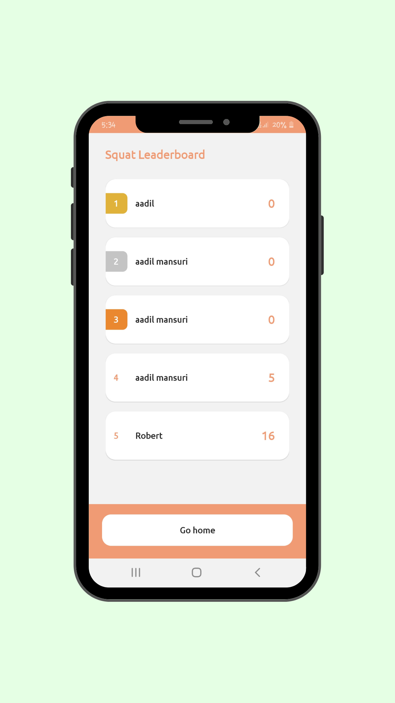

# FitCount Apps

**Title:-** Posture Analysis and Rep Counting for Fitness and Wellness

**Language Used:-** Kotlin

**Technology Used:-** Tensorflow lite posenet model

**Screen Shots**

  
  
  

  
  
  

**Concept:**

This app platform leverages camera AI and pose detection to create a comprehensive health and fitness companion app. It offers functionalities for both healthcare professionals and individual users, focusing on:

-Posture Analysis: Analyze a user's posture in real-time using the phone's camera, identifying potential imbalances or misalignments.

-Rep Counting: Accurately count repetitions of various exercises performed by the user through pose detection.

**Target Users:**

1.Individual Users: Fitness enthusiasts, athletes, and people focused on general well-being can utilize the app for:

-Monitoring their posture during exercise routines or daily activities.
-Receiving feedback on proper form while performing exercises.
-Tracking workout progress by accurately counting repetitions.

2.Healthcare Professionals: Physical therapists, chiropractors, and fitness trainers can use the app for:

-Remotely monitoring patient posture and progress during rehabilitation exercises.

-Providing personalized coaching and feedback on form and technique.

-Tracking patient workout data for performance analysis and progress reports.

**AI Functionality:**

1.Pose Estimation: The app utilizes a pre-trained pose estimation model to detect key body joints (e.g., shoulders, elbows, knees) in real-time through the phone's camera.

2.Posture Analysis: Based on the detected joint positions, the AI compares them to a pre-defined database of ideal postures for various activities (e.g., standing, squatting, lunges). Deviations from the ideal posture can be highlighted and feedback provided for improvement.

3.Rep Counting: The AI tracks the movement of key joints throughout an exercise (e.g., push-ups, squats) and identifies the complete repetitions based on specific joint angles and movement patterns. Users can set the desired exercise type, and the app will automatically count repetitions.

**App Platform Features:**

-Exercise Library: A comprehensive library of exercises with video demonstrations and detailed instructions on proper form.

-Posture Feedback: Real-time visual and audio feedback on posture alignment during exercise or daily activities.

-Workout Tracking: Track workout progress by logging exercises, sets, repetitions, and receiving performance reports.

-Personalization: Users can set fitness goals and customize workout routines based on their needs.

-Remote Coaching: Healthcare professionals can monitor patient posture and progress remotely, providing personalized coaching and feedback.

**Benefits:**

1.Improved Posture: Helps users maintain proper form during exercise, reducing the risk of injuries and improving overall well-being.

2.Effective Workouts: Ensures exercises are performed correctly, maximizing workout effectiveness and achieving fitness goals faster.

3.Personalized Training: Provides individual exercise recommendations and feedback, tailoring the experience to specific needs.

4.Remote Patient Care: Enables healthcare professionals to monitor and coach patients remotely, increasing accessibility and improving healthcare delivery.

Overall, this AI-powered app platform creates a valuable tool for both individual fitness enthusiasts and healthcare professionals, promoting improved posture, effective workouts, and personalized training for a healthier and more active lifestyle.

